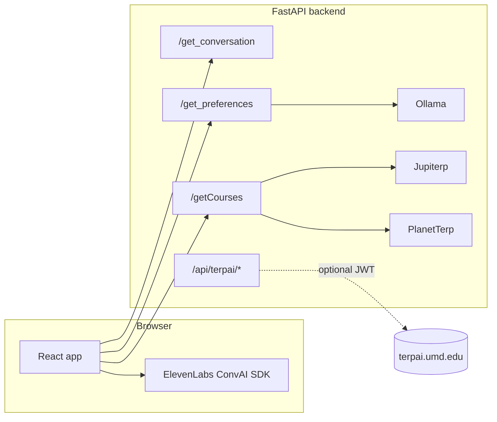
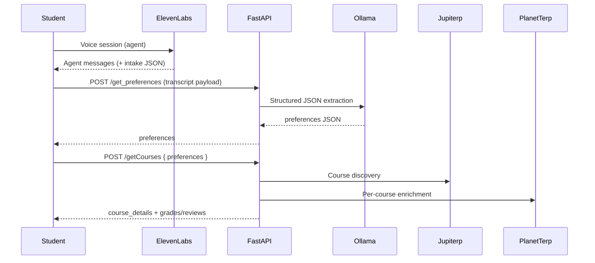

# Shell AI

**Voice first AI academic advisor for the University of Maryland.**

Shell has a conversation with you, infers what you need from the semester (GPA, research, exploration, constraints) and surfaces **real course sections** through **Jupiterp** and **PlanetTerp** grade context plus persona aware UI, GPA tools and optional **university analytics** for admins. The product voice is **Terp** (Testudo energy)

---

## Why we built it

Course registration at UMD still feels like a scavenger hunt: Testudo for sections, PlanetTerp for grades and vibes, random spreadsheets for workload, and group chats for “who’s in this section?” Nobody asks **what you want this semester to do for you** and then adapts the whole stack to that answer.

**Shell** is our Bitcamp 2026 answer: one conversational intake, structured preferences, and a UI that leans **researcher / GPA-safe / explorer** depending on inferred goals without pretending one static catalog fits every student.

---

## What’s in the box

| Surface | What it does |
|--------|----------------|
| **Student app** (`/`) | ElevenLabs **Conversational AI** (voice), optional signed-URL mode, transcript → **`/get_preferences`** (Ollama JSON extraction) → **`/getCourses`** (Jupiterp + PlanetTerp enrichment). |
| **Admin** (`/admin`) | Lightweight admin shell aligned with the same design system. |
| **University analytics** (`/universityAnalytics`) | Dashboard (KPIs, demand bars, goal donut, migration, nudges, mock Terp Intelligence chat). `GET /universityAnalytics` on the backend returns placeholder JSON for future wiring. |
| **TerpAI (UMD Nebula) — partial** | Backend includes **`/api/terpai/*`** proxies that forward to `terpai.umd.edu` with a **Bearer JWT** from the client. **Not** wired into the main student happy path yet (see below). |

---

## TerpAI (Nebula) integration — current status

We **did** implement a workable **HTTP proxy** pattern (see `backend/terpai_umd_routes.py` and `backend_example/`): the browser never holds long lived campus secrets; the server can attach Cosmos/session headers and stream chat like the official flow.

We **did not** fully productise Shell inside the student journey for Bitcamp because:

1. **Bearer tokens** — Nebula auth expects a JWT that **expires**; a production integration needs refresh (or server-side session exchange), not a one shot paste into `.env`.
2. **TLS / institutional endpoints** — `terpai.umd.edu` certificate chains and local dev trust vary; we exposed `TERPAI_SSL_VERIFY` / `insecure_ssl` as an **explicit dev-only** escape hatch, not something we wanted to bake into the default student path.
3. **`terpai_scheduling` on `/getCourses`** — The hook that called UMD TerpAI for scheduling-style summaries is **commented out** in `backend/main.py` until tokens + SSL + error semantics are boring and reliable.

The **workaround** for the hackathon: **Jupiterp + PlanetTerp** carry course truth; preferences come from **Ollama** on transcript; the UI stays shippable without blocking on campus infra.

---

## Tech stack

| Layer | Choices |
|-------|---------|
| **Frontend** | React 18, Vite 6, React Router — `frontend/` |
| **Voice** | **ElevenLabs** ConvAI (`@elevenlabs/client`) — not the browser Web Speech API |
| **Backend** | FastAPI, Uvicorn — `backend/` |
| **LLM (preferences + optional persona)** | **Ollama** (`ollama` Python client); default model in code is cloud capable (`kimi-k2.5:cloud` when set in env) — override with `OLLAMA_MODEL` |
| **Course data** | **Jupiterp** (sections / SOC-style payload) + **PlanetTerp** API enrichment (grades, reviews, descriptions) |
| **Optional** | ElevenLabs REST for signed URLs + conversation fetch; UMD TerpAI proxy routes under `/api/terpai` |

---

## Repository layout

```
TerpAI/
├── frontend/          # Vite + React (Terp student UI, admin, university analytics)
├── backend/           # FastAPI: ConvAI signing, preferences, courses, TerpAI proxy stubs
└── README.md          # This file
```

---

## Architecture (high level)



**Typical student session**



---

## Prerequisites

- **Node.js** 18+ (20 LTS recommended)
- **Python** 3.11+ (3.12 OK)
- **Ollama** running locally (or reachable host) with a model pulled, e.g.  
  `ollama pull llama3.2`  
  Set `OLLAMA_MODEL` in `backend/.env` to the tag you use.
- **ElevenLabs** account: **API key** + **ConvAI agent id** for signing and conversation fetch (see env examples).
- Optional: **Jupiterp** / network access as required by your `jupiterp.py` configuration.

---

## Environment variables

Copy examples and edit:

```bash
cp backend/.env.example backend/.env
cp frontend/.env.example frontend/.env
```

- **`backend/.env`** — `ELEVENLABS_API_KEY`, `ELEVENLABS_AGENT_ID`, Ollama settings, optional `TERPAI_*` and `TERPAI_SSL_VERIFY` (see comments in file).
- **`frontend/.env`** — `VITE_ELEVENLABS_AGENT_ID` (public agent) and optionally `VITE_API_BASE_URL`, signed-URL flags (see `frontend/.env.example`).

---

## How to run (development)

### 1. Backend (from `backend/`)

```bash
cd backend
python -m venv .venv
source .venv/bin/activate          # Windows: .venv\Scripts\activate
pip install -r requirements.txt
# Ensure Ollama is running and OLLAMA_MODEL matches a pulled model
uvicorn main:app --reload --port 8000
```

- API docs: **http://127.0.0.1:8000/docs**

### 2. Frontend (from `frontend/`)

```bash
cd frontend
npm install
npm run dev
```

- App: **http://localhost:5173** (Vite default)
- Routes: `/` (Terp), `/admin`, `/universityAnalytics`

The Vite dev server proxies API paths such as `/get_preferences` and `/getCourses` to port **8000** when `VITE_API_BASE_URL` is unset (see `frontend/vite.config.js`).

### 3. Production-style build (frontend only)

```bash
cd frontend
npm run build
npm run preview    # optional: serve dist locally
```

---

## Useful commands (cheat sheet)

| Command | Where | Purpose |
|---------|--------|---------|
| `npm install` | `frontend/` | Install JS dependencies |
| `npm run dev` | `frontend/` | Vite dev server + HMR |
| `npm run build` | `frontend/` | Production bundle → `dist/` |
| `npm run preview` | `frontend/` | Preview `dist/` |
| `python -m venv .venv` | `backend/` | Create virtualenv |
| `pip install -r requirements.txt` | `backend/` | Install Python deps |
| `uvicorn main:app --reload --port 8000` | `backend/` | Dev API server |

---

## Design notes (voice + trust)

- **Voice** is handled entirely by **ElevenLabs** streaming/WebRTC per their SDK—not `webkitSpeechRecognition`.
- **Private agents**: the backend exposes **`GET /get_conversation`** so the **API key never ships to the browser**.
- **Preferences** are extracted server-side from the session payload so the model sees full transcript context (see `_build_preferences_user_content` in `backend/main.py`).

---

## Built at **Bitcamp 2026**

Shell was built as a **Bitcamp 2026** project: ship a credible end to end advisor loop (voice → structure → real courses → rich UI) on a short clock, with honest boundaries on campus only integrations.

